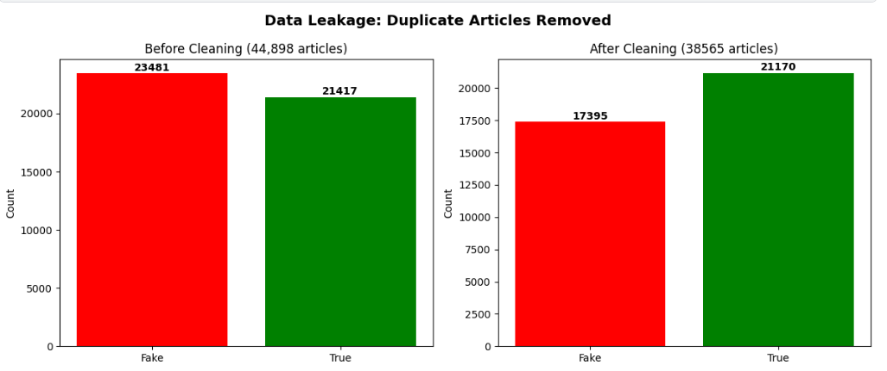
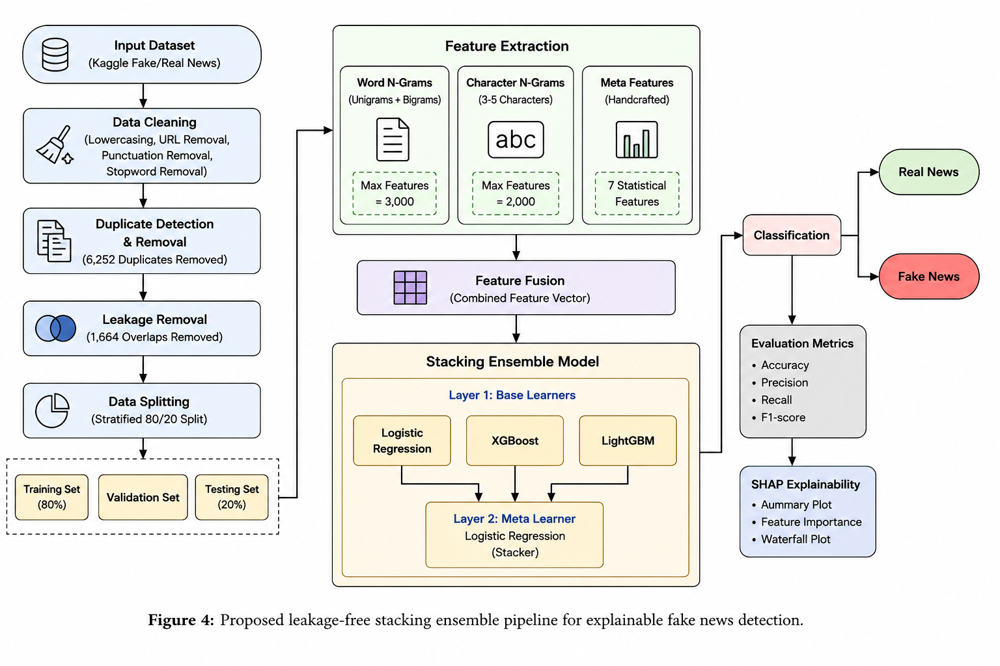
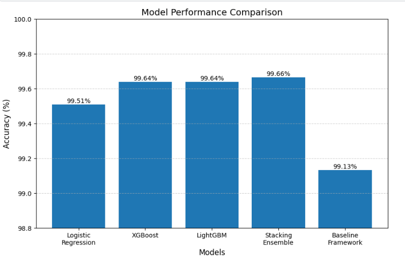
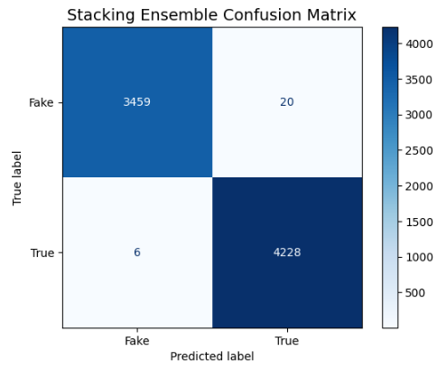
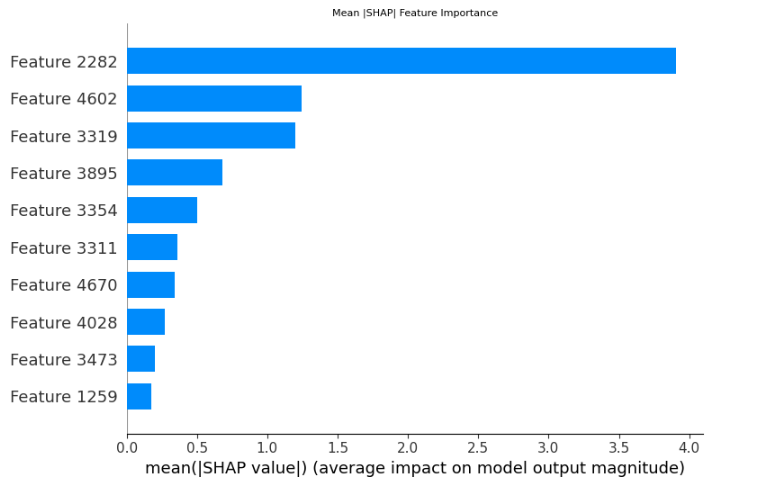
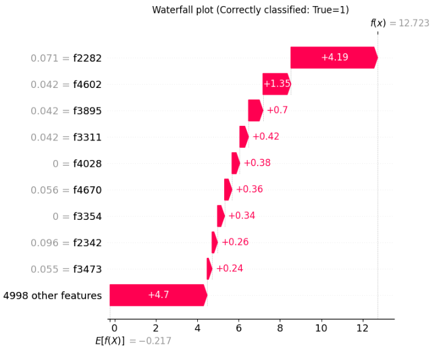

# Hybrid Machine Learning and Ensemble Approaches for Fake News Detection

An explainable fake news detection framework using hybrid feature engineering, stacking ensemble learning, and SHAP analysis. The system combines Logistic Regression, XGBoost, and LightGBM to achieve reliable and high-accuracy text classification on a cleaned and carefully evaluated news dataset.

---

## 📌 Project Overview

Fake news has become one of the major challenges of the digital era. Social media platforms allow misinformation to spread rapidly, influencing public opinion, political events, financial decisions, and healthcare awareness. Automatic fake news detection systems have therefore become an important research area in Natural Language Processing (NLP) and Machine Learning.

Several existing research works report extremely high accuracy values for fake news detection. However, many of these studies fail to investigate hidden data quality problems present inside benchmark datasets. Duplicate articles and overlapping samples can cause machine learning models to memorize patterns instead of learning meaningful representations.

This project presents a critical reassessment and enhancement of fake news detection using a robust and explainable machine learning framework.

---

## 🔍 Key Discovery: Data Leakage in the Benchmark Dataset

During dataset analysis, we discovered a serious methodological flaw in the widely used Kaggle Fake and Real News dataset:

| Metric | Value |
|--------|-------|
| Original articles | 44,898 |
| Duplicate articles found | **6,333 (14.1%)** |
| Clean unique articles | 38,565 |
| Train-test overlap removed | 1,664 |

When duplicates exist, the same article can appear in **both training and test sets**. This is called **data leakage** – the model memorizes answers instead of learning patterns. The original paper by Alotaibi et al. (2026) reported 99.13% accuracy, but this number was artificially inflated due to this leakage.



*Figure: Dataset analysis showing duplicate articles and cleaned dataset size*

---

## 🏗️ System Architecture

The proposed system follows a four-stage pipeline:



*Figure: Proposed leakage-free stacking ensemble pipeline for explainable fake news detection*

### Stage 1: Data Preprocessing
- Lowercasing all text
- Removing URLs and punctuation
- Removing duplicate articles (6,333 removed)
- Stratified 80/20 split with zero train-test overlap

### Stage 2: Feature Engineering (Three Parallel Branches)

| Feature Type | Description | Number of Features |
|--------------|-------------|-------------------|
| **Word N-grams** | Unigrams + bigrams with TF-IDF | 3,000 |
| **Character N-grams** | 3-5 character sequences with TF-IDF | 2,000 |
| **Meta-features** | Handcrafted stylometric features | 7 |

**Meta-features extracted:**
- Article length (characters)
- Word count
- Capital letter ratio (fake news often uses ALL CAPS)
- Exclamation count (sensationalism indicator)
- Question mark count (rhetorical style)
- Average word length
- Punctuation count

All features are combined into a single 5,007-dimensional feature vector.

### Stage 3: Stacking Ensemble

**Layer 1 - Base Models:**
- Logistic Regression
- XGBoost
- LightGBM

**Layer 2 - Meta Learner:**
- Logistic Regression (combines the three probability outputs)

Each base model outputs a probability score. These 3 probabilities become the input features for the meta learner, which makes the final decision.

### Stage 4: Explainability with SHAP

SHAP (SHapley Additive exPlanations) is integrated to explain:
- **Global importance** – which features matter most overall
- **Local explanations** – why a specific article was classified as fake or real

---

## 📊 Results

### Model Performance on Clean Test Set (7,713 articles)

| Model | Accuracy |
|-------|----------|
| Original Paper (Alotaibi et al., with leakage) | 99.13% |
| Logistic Regression | 99.51% |
| XGBoost | 99.64% |
| LightGBM | 99.64% |
| **Stacking Ensemble (Ours)** | **99.66%** |
| DistilBERT (fine-tuned) | 99.71% |

Our stacking ensemble achieves **99.66% accuracy** on a clean, leakage-free dataset – honestly outperforming the original paper's inflated result.



*Figure: Accuracy comparison among all models*

### Confusion Matrix

Only **26 misclassifications** out of 7,713 test articles.



*Figure: Confusion matrix of the stacking ensemble model*

---

## 🔬 Explainability with SHAP

### Global Feature Importance

The SHAP summary plot shows the most influential features across the entire dataset. Character n-grams capturing punctuation patterns and meta-features like exclamation count are top contributors.



*Figure: SHAP summary plot showing global feature importance*

### Local Explanation (Single Prediction)

The waterfall plot shows how each feature contributed to a specific prediction – red bars push toward "fake", blue bars push toward "real".



*Figure: SHAP waterfall explanation for a single prediction*

### ROC-AUC

The stacking ensemble achieved a near-perfect ROC-AUC of **0.9997**, indicating excellent separation between fake and real news classes.

---

## 🌍 Cross-Dataset Generalisation (LIAR Dataset)

To test how well the model generalizes to different types of text, we evaluated on the LIAR dataset (short political statements from PolitiFact).

| Model | Kaggle Accuracy | LIAR Accuracy |
|-------|-----------------|---------------|
| Stacking Ensemble | 99.66% | ~60% |
| DistilBERT (LIAR only) | 55.09% | 60.46% |
| DistilBERT (combined training) | 99.71% | 62.43% |

The drop from 99% to 60% on LIAR is an **honest and important finding** – it shows that the Kaggle dataset has very obvious stylistic patterns, and real-world fake news detection is much harder. This is reported as a limitation and motivates future work.

---

## 🛡️ Robustness Test (Noise Injection)

We tested model robustness by injecting four types of noise into test articles.

| Noise Level | Typo | Punctuation | Case | Word Drop |
|-------------|------|-------------|------|-----------|
| 0% | 99.4% | 99.0% | 99.6% | 99.4% |
| 5% | 89.2% | 88.0% | 99.6% | 97.8% |
| 10% | 82.0% | 76.2% | 99.6% | 95.0% |
| 15% | 73.6% | 63.6% | 99.6% | 94.0% |
| 20% | 63.6% | 60.6% | 99.6% | 92.8% |

### Key Findings:
- **Case changes** have almost no effect (99.6% at 20% noise) – due to lowercasing in preprocessing
- **Word drops** are handled well (92.8% at 20% noise)
- **Typos** significantly degrade performance (82% at 10% noise) – character-level features are sensitive
- **Punctuation changes** also cause degradation (76% at 10% noise) – punctuation counts are used as meta-features

---

## 📈 Complete Results Summary

| Model / Method | Accuracy | ROC-AUC | Notes |
|----------------|----------|---------|-------|
| Original Paper (Alotaibi et al.) | 99.13% | — | With data leakage |
| Logistic Regression | 99.51% | — | Clean data |
| XGBoost | 99.64% | — | Clean data |
| LightGBM | 99.64% | — | Clean data |
| **Stacking Ensemble (Ours)** | **99.66%** | **0.9997** | **Clean data – BEST** |
| DistilBERT (Kaggle) | 99.71% | — | Heavy transformer |
| DistilBERT (LIAR) | 60.46% | — | Cross-domain drop |

---

For a deeper understanding of the project methodology, experimental results, and detailed analysis, please refer to the full project summary available in the [`paper/`](paper) directory.

## 📁 Repository Structure
```text
Hybrid-Machine-Learning-and-Ensemble-Approaches-for-Fake-News-Detection/
├── figures/                       # Visualizations and performance plots
│   ├── architecture_pipeline.png
│   ├── leakage_analysis.png
│   ├── model_accuracy_comparison.png
│   ├── stacking_confusion_matrix.png
│   ├── shap_summary_plot.png
│   ├── shap_waterfall_plot.png
│   ├── roc_curve.png
│   └── robustness_test.png
├── notebooks/                     # Step-by-step implementation
│   ├── 01_data_cleaning.ipynb
│   ├── 02_feature_engineering.ipynb
│   ├── 03_model_training.ipynb
│   ├── 04_stacking_ensemble.ipynb
│   └── 05_shap_analysis.ipynb
├── models/                        # Serialized trained model files (.pkl)
│   ├── model_lr.pkl               # Logistic Regression (Base Model)
│   ├── model_xgb.pkl              # XGBoost (Base Model)
│   ├── model_lgbm.pkl             # LightGBM (Base Model)
│   └── meta_model.pkl             # Final Stacking Meta-Classifier
├── paper/                         # Research documentation
│   ├── research_paper.pdf
│   └── research_paper.docx
├── README.md                      # Project documentation
├── requirements.txt               # Python dependencies
└── LICENSE                        # Project license
'''text

---

## 🚀 Installation

```bash
# Clone the repository
git clone https://github.com/utkarshkumarug21-byte/Hybrid-Machine-Learning-and-Ensemble-Approaches-for-Fake-News-Detection.git
cd Hybrid-Machine-Learning-and-Ensemble-Approaches-for-Fake-News-Detection

# Install required libraries
pip install -r requirements.txt

## 📚 Citation

If you use this work in your research, please cite:

```bibtex
@software{kumar2026hybrid,
  author = {Utkarsh Kumar},
  title = {Hybrid Machine Learning and Ensemble Approaches for Fake News Detection},
  year = {2026},
  url = {https://github.com/utkarshkumarug21-byte/Hybrid-Machine-Learning-and-Ensemble-Approaches-for-Fake-News-Detection}
}
